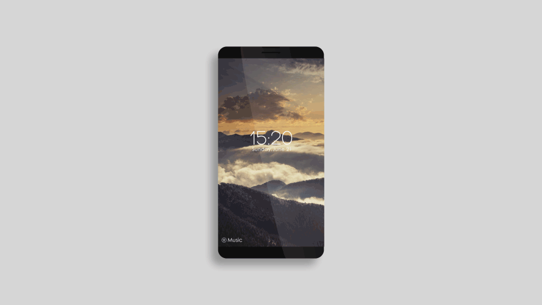

# QtQuickAppDemo

QtQuickAppDemo, implement some animation effect reference by AE.

参考 AE 做应用。

或许会参考网上一些使用 AE 制作的动态 demo，然后使用 QML 实现吧。

---

2015.12.04

> 2015-12-04-001

[AE制作APP界面动效](http://www.fevte.com/tutorial-26737-1.html)

效果图如下：

QML 效果图如下：

> finished : 2015-12-05

---

2015.12.05

[AE打造手机音乐界面动效](http://www.fevte.com/tutorial-27299-1.html)

效果图如下：

QML 效果图如下：

> finished : 2015-12-06

---

2015.12.19

[path for iOS设计细节赏析](http://www.ui.cn/detail/82933.html)

决定折腾一下这个了。

2015.12.29

算是折腾一个了吧。但是严格来说更像是实现一个 `layer.js` 呢。

项目 [Sparrow.PopuopItem](https://github.com/GDPURJYFS/Sparrow/tree/master/qml/Sparrow/PopupLayer)

效果图如下吧。

可能还要继续填坑吧。

2016.12.25

添加安卓手机系统界面仿制

---

其他有趣的示例

## Simple QML Gallery(Test)

> 图片浏览器，有出场和退场效果

[MidoriYakumo/qml-simpleimageviewer](https://github.com/MidoriYakumo/qml-simpleimageviewer)

## MidoriYakumo/qml-shader-plot

> 使用 GLSL 制作的函数绘线

[MidoriYakumo/ShaderPlot](https://github.com/MidoriYakumo/ShaderPlot)

## Furkanzmc/QML-UI-Animations

> 

[Furkanzmc/QML-UI-Animations](https://github.com/Furkanzmc/QML-UI-Animations)
